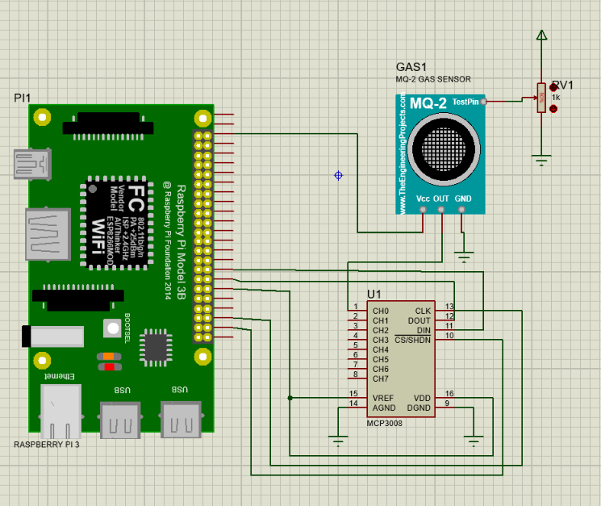
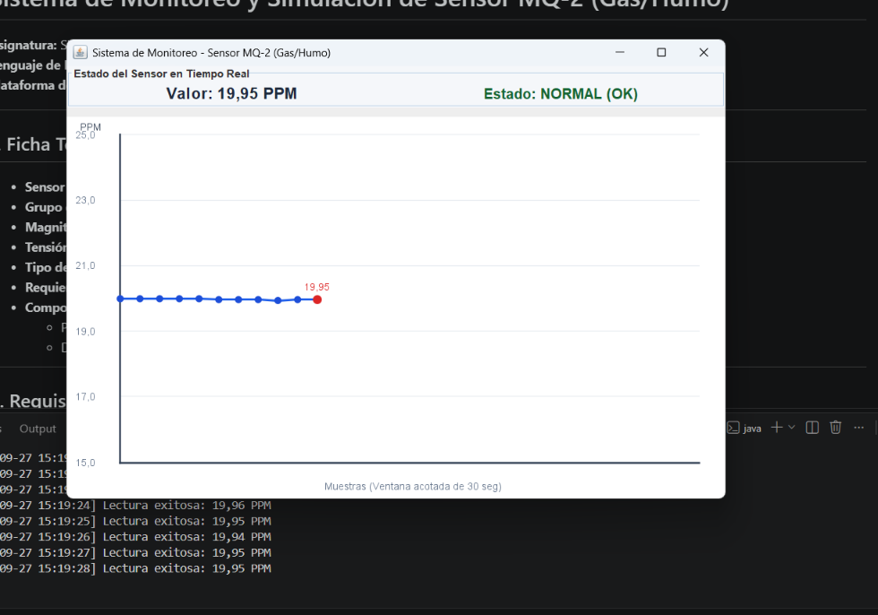

# Sistema de Monitoreo y Simulación de Sensor MQ-2 (Gas/Humo)
**Asignatura:** Sistemas Digitales III  
**Lenguaje de Desarrollo:** Java  
**Plataforma de Despliegue:** Raspberry Pi / Linux  

---

## 1. Ficha Técnica del Sensor (Fase 1)

* **Sensor Asignado:** MQ-2 (Detector de humo y gases combustibles)
* **Grupo de Simulación:** Químico MOS (Óxido Metálico Semiconductor)
* **Magnitud Medida:** Concentración de gas/humo en Partes Por Millón (PPM)
* **Tensión de Alimentación:** 5V DC
* **Tipo de Salida:** Analógica (0V - 5V) continua
* **Requiere ADC:** Sí (MCP3008 mediante interfaz SPI en Raspberry Pi)
* **Comportamiento Característico:** 
  * Periodo de precalentamiento inicial obligatorio.
  * Deriva lenta del valor base por cambios de temperatura y humedad ambiental.

---

## 2. Requisitos y Arquitectura del Programa (Fase 2)

El desarrollo cumple estrictamente con la **separación de capas**:
* **Sensor.java**: Interfaz común que aísla la lógica del hardware.
* **QuimicoSimulado.java**: Clase que simula el modelo matemático del grupo Químico MOS (precalentamiento, deriva lenta y ruido gaussiano).
* **App.java**: Módulo principal de la aplicación que gestiona la interfaz gráfica (Swing), el guardado en CSV con ventana acotada de datos y la tolerancia a fallos.
* **PruebasSensor.java**: Suite de pruebas automatizadas para validar la robustez.

---

## 3. Esquema de Conexión en Raspberry Pi

Debido a que la Raspberry Pi no cuenta con entradas analógicas nativas, se requiere un conversor analógico-digital (ADC) **MCP3008**:

---

## 4. Formato de Registro de Datos (CSV)

El muestreo guarda los datos cada 1 segundo en el archivo `registro_mq2.csv` utilizando una estampa de tiempo legible (`yyyy-MM-dd HH:mm:ss`):

---

## 5. Instrucciones de Compilación y Ejecución (Fase 3 y 4)

### Prerrequisitos
* Java Development Kit (JDK 11 o superior instalado).

### Compilar el Proyecto
Desde la terminal en el directorio raíz del proyecto:
javac *.java

### Ejecutar la Aplicación Principal (Gráfica y Muestreo)
java App

### Ejecutar las Pruebas Automatizadas
java PruebasSensor

---

## 6. Despliegue como Servicio del Sistema (Fase 5)

Para garantizar el autoarranque al encender la Raspberry Pi y el reinicio automático ante fallos inesperados, se crea el servicio `systemd`.

1. **Crear el archivo de servicio:** `/etc/systemd/system/mq2_sensor.service`

[Unit]
Description=Servicio de Monitoreo del Sensor MQ-2
After=network.target

[Service]
Type=simple
User=pi
WorkingDirectory=/home/pi/simulador-sensor
ExecStart=/usr/bin/java -cp /home/pi/simulador-sensor App
Restart=always
RestartSec=5

[Install]
WantedBy=multi-user.target

2. **Habilitar e Iniciar el Servicio:**
sudo systemctl daemon-reload
sudo systemctl enable mq2_sensor.service
sudo systemctl start mq2_sensor.service

3. **Verificar el Estado del Servicio:**
sudo systemctl status mq2_sensor.service